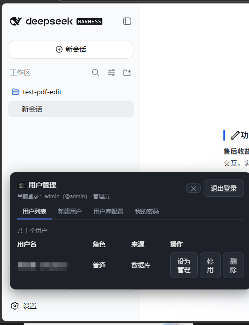

# dsh-user-manager

DeepSeek Harness（`dsh`）插件：为单机的 harness 增加**用户管理**与**会话按用户隔离**。



- **用户库两种模式**：本地数据库（SQLite / MySQL / PostgreSQL 三选一）或 LDAP / AD，均可在页面配置并热切换。
- **登录鉴权**：用户名 + 口令登录，HMAC-SHA256 签名的 HttpOnly Cookie 维持登录态。
- **会话隔离**：每个用户只能看到并访问自己创建的会话，越权访问在 HTTP 层被拒绝。
- **管理员**：账号与口令由环境变量指定，权限限定为用户管理（看不到他人会话）。

> 隔离强度为 **API 层隔离**：列举、访问、以及两条实时事件流（`events.mux` / `events.host`，
> 浏览器侧为 WebSocket 升级连接）都做了归属过滤与越权拒绝 —— 每个用户只能看到自己创建的
> 会话，他人会话的实时帧在泵给浏览器前就被丢弃，UI 不会出现也不会泄漏内容。
>
> 会话归属不写在 harness 的会话数据里（那里没有 owner 字段），而是记在插件自己的
> 索引中：`$DSH_HOME/user-manager.yaml` 的 `ownership` 段（用户 id → 会话 id 列表）。

---

## 安装

```bash
cd dsh-user-manager
npm install
npm run build

# 链接进 web profile（安装为 ~/.dsh/profiles/web 的 link: 依赖）
npx @deepseek-ai/dsh plugin --profile web add .

# 校验插件树是否加载成功
npx @deepseek-ai/dsh --profile web --dump-config
```

**改动源码后必须重启 host** —— 插件集在 boot 时扫描并缓存。

数据库驱动按引擎按需加载，只在真正用到时才要求存在：

| 引擎 | 需要的包 |
| --- | --- |
| `sqlite`（默认） | `better-sqlite3` |
| `mysql` | `mysql2` |
| `postgres` | `pg` |
| LDAP 模式 | `ldapts` |

它们声明为 `optionalDependencies`，`npm install` 会一并装上；如果手动裁剪过
`node_modules`，缺驱动时会在切换 / 测试连接时报出明确的包名与安装命令。

---

## 环境变量

管理员账号**只**从环境变量读取，不写入任何配置文件：

| 变量 | 说明 |
| --- | --- |
| `DSH_ADMIN_USERNAME` | 管理员登录名 |
| `DSH_ADMIN_PASSWORD` | 管理员明文口令 |
| `DSH_ADMIN_PASSWORD_HASH` | 口令哈希，二选一。支持 `scrypt$N$r$p$saltB64$keyB64` 或 `saltHex:keyHex` |
| `DSH_SESSION_SECRET` | 登录态签名密钥。**建议设置**：不设则每次启动随机生成，重启后所有人需要重新登录 |

管理员是**兜底账号**：数据库或 LDAP 不可用时，用它登录进去修配置。

```bash
export DSH_ADMIN_USERNAME=admin
export DSH_ADMIN_PASSWORD='please-change-me'
export DSH_SESSION_SECRET="$(openssl rand -hex 32)"
```

---

## profile 配置

`cordis.patch.yml` 已把插件行插入配置树，无需再写一遍。可选的完整配置：

```yaml
- insert:
    - id: user-manager
      name: dsh-user-manager
      config:
        mode: database            # database | ldap
        database:
          engine: sqlite          # sqlite | mysql | postgres
          filename: dsh-users.sqlite
        # database:               # mysql / postgres 用这一组
        #   engine: postgres
        #   host: 10.0.0.5
        #   port: 5432
        #   database: dsh
        #   user: dsh
        #   password: secret
        #   ssl: true
        auth:
          sessionTtlSeconds: 43200
          cookieName: dsh_user
          cookieSameSite: lax
          scryptCost: 16384
          unownedSessions: admin  # admin | everyone | none
        enforce: true             # 关掉则只做用户管理，不隔离会话
```

LDAP 模式：

```yaml
      config:
        mode: ldap
        ldap:
          url: ldaps://dc.example.com:636
          bindDn: CN=svc-dsh,OU=Service,DC=example,DC=com
          bindPassword: secret
          searchBase: OU=Users,DC=example,DC=com
          searchFilter: (sAMAccountName={username})   # OpenLDAP 常用 (uid={username})
          displayNameAttribute: displayName
          adminDns:
            - CN=Alice,OU=Users,DC=example,DC=com
          tlsRejectUnauthorized: true
          timeoutMs: 10000
```

配置项说明：

| 配置 | 默认 | 说明 |
| --- | --- | --- |
| `mode` | `database` | 用户来源 |
| `auth.sessionTtlSeconds` | `43200` | 登录态有效期（秒） |
| `auth.cookieName` | `dsh_user` | Cookie 名 |
| `auth.cookieSameSite` | `lax` | Cookie 的 SameSite |
| `auth.scryptCost` | `16384` | 口令哈希的 scrypt cost（2 的幂） |
| `auth.unownedSessions` | `admin` | 启用前就存在的历史会话归谁可见：`admin` / `everyone` / `none` |
| `auth.adminOnlyMethods` | `[]` | 追加"仅管理员可调用"的 `/api` 方法 |
| `enforce` | `true` | 是否启用会话隔离 |

---

## 使用

1. 启动 harness，浏览器打开 Web 界面 —— 未登录时会看到登录遮罩。
2. 用环境变量里的管理员账号登录。
3. **管理员**会在侧边栏底部看到「👥 用户」入口（找不到插槽时回退为左下角浮动按钮），
   打开后是**多页面面板**，顶部导航切换：
   - **用户列表**：表格 + 行内操作（设为管理/普通、启用/停用、删除）；
   - **新建用户**：独立表单页，创建后自动刷新列表；
   - **用户库配置**：切换模式（数据库 / LDAP），填写连接信息后**测试连接**再**保存并切换**；
   - **我的密码**：修改本人登录口令。
4. **普通用户**登录后也会挂载面板，但只显示「我的密码」页（入口名「🔑 账户」），看不到用户管理。
5. 所有登录用户只能看到自己创建的会话。

连接配置（含数据库口令）保存在 `$DSH_HOME/user-manager.yaml`，与会话归属索引同文件。
**该文件含明文口令，注意权限**。

---

## 工作原理

插件全部建立在 `ctx.webServer` 的 HTTP 路由表上，分三块：

| 块 | 路径 | 作用 |
| --- | --- | --- |
| 自控路由 | `/user-manager/*` | 登录 / 登出 / me / 用户管理 / 连接配置与测试 |
| 影子路由 | `/api/<method>`（exact） | 登录态校验 + 会话归属过滤 / 越权拒绝 |
| index 注入 | `<body>` 之后一段脚本 | 未登录时盖住应用，登录成功后放行 |

**为什么影子化 HTTP 路由**：`ctx.connection.rpc.handle` 的回调签名是
`(endpoint, payload, signal)`，读不到 Cookie，识别不了调用者。而 `webServer` 的匹配是
「exact 优先，其次最长前缀」，connection 插件把 `/api` 注册为 prefix，
所以这里用 exact 注册具体方法即可合法接管并拿到原生 `req`。

真实数据在同进程直接调 `ctx.apiProxy` 的具名方法取得，不经 HTTP，因此不会自环。

被接管的方法见 `src/gate.ts` 的 `METHOD_RULES`；未列出的方法直接放行，
harness 新增方法不会因为插件没跟上而整体不可用。

---

## 已知限制

1. **事件流按 owner 维度隔离（WebSocket 逐帧过滤）**。`/api/events.mux` 与 `/api/events.host` 在浏览器侧是
   **WebSocket 升级**连接（harness `api-path.ts` 称之为 "Browser … WebSocket pathname"，
   plain GET 会被回 `426 Upgrade Required`），由 `WebSocketDownlinks` 承载，走 webserver
   独立的升级分发 —— HTTP 的 exact/prefix 路由**不参与**，所以只在 HTTP 层接管是拦不住的。
   插件因此做了两件事（`src/events-ws.ts`）：
   - 在 http server 上替换 `upgrade` 监听器：事件流路径先做 Cookie 鉴权（未登录回 401），
     再把「本连接的帧过滤器」放进 `AsyncLocalStorage`，最后调用 webserver 原监听器；
   - 包装 `apiProxy.events.mux/host`：downlink 每次升级都在调用栈内同步打开上游流，
     包装层读到连接身份即逐帧按**归属（owner）**过滤，他人会话的帧在泵给浏览器前就被丢弃。
     无连接上下文的调用（进程内其他调用方）原样透传。
   - gate.ts 里同路径的 exact GET 路由保留为兜底，只服务非浏览器调用方与手工验证。
   - **为什么用 owner 而非 allowed**：harness 在 `session.create` 执行期间就广播 `host/session-added` / `host/workspace-changed`，而本插件认领归属是在 create 返回之后才写入。新建会话在广播瞬间处于"无主"窗口，若按 `allowed` 过滤（无主会话对管理员可见）管理员会实时收到他人刚建的会话、并在侧边栏永久渲染。因此实时流一律按 owner 维度：无主会话不进任何人的实时流。
   - `sessionId` 缺省的帧（如 `stream/error`）透传；`host/archived-sessions-changed`、`host/workspace-changed` 内的会话 id 列表就地裁剪为 owner 维度。
   - 子代理会话：`subagent.prompt` 只回 `messageId`（拿不到子会话 id），无法在 API 层认领；插件在 `host/session-added` 帧里借 `parentSessionId` 把子会话认领给父会话的拥有者（`claimSubagentChild`），从而纳入同一用户的隔离。

2. **`session.export` 不可用**。它是 `GET` + query 参数、不走 JSON 信封，且插件持有的
   路由无法把请求转交给同路径的官方 handler（会自环）。插件只做了归属校验，
   通过校验的请求会返回 `501`，也就是**安装本插件期间会话导出功能不可用**。

3. **无主历史会话只进列表基线、不进实时流**。启用插件之前就存在的会话没有归属记录，按
   `auth.unownedSessions` 处置（默认仅管理员在 `session.list` / `workspace.list` 基线可见，且为只读、无实时更新）。
   新建的、已被认领的会话对其他人完全不可见（列表与实时流都过滤）。子代理会话经认领后同样归入父会话拥有者。

4. **管理员只看用户**。管理员不能查看或操作他人的会话 —— 这是设计选择，
   不是缺陷。要审计能力得改 `src/gate.ts` 的 `allowed()`。

5. **LDAP 为只读目录**。用户的增删改只在数据库模式下可用；LDAP 模式下用户由目录管理员维护。

---

## 开发

```bash
npm run typecheck   # tsc --noEmit
npm run build       # tsc + wrap-client（生成浏览器端闭包 bundle）
npm test            # 烟测（口令/票据/归属/SQLite） + 端到端装配测试
```

测试不依赖真实 harness：`scripts/integration.mjs` 用最小假上下文驱动真实插件，
覆盖登录、过滤、越权拒绝、登出与连接释放。

代码地图见 [AGENTS.md](AGENTS.md)。
